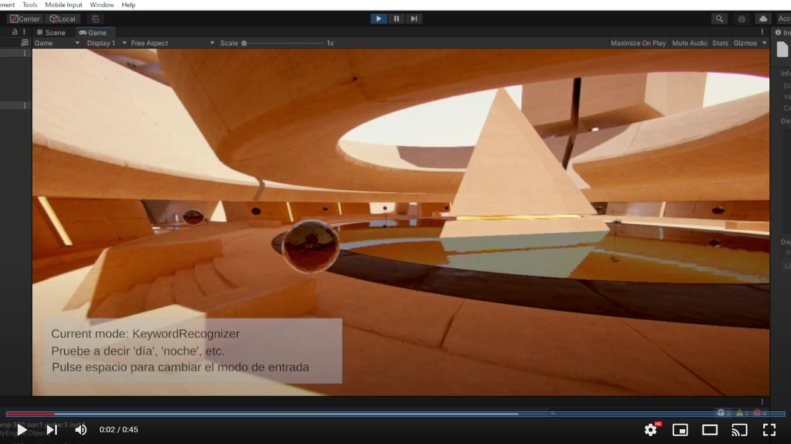

# Práctica 5: Reconocimiento de voz en Unity3D <!-- omit in toc -->

> El objetivo de esta práctica es aprender a utilizar las herramientas de reconocimiento de voz que Unity3D ofrece para Windows 10.

* Javier Correa Marichal (alu0101233598)
* Nerea Rodríguez Hernández (alu0101215693)
* Interfaces Inteligentes 21/22
* Universidad de La Laguna

### Tabla de contenidos <!-- omit in toc -->
- [KeywordRecognizer](#keywordrecognizer)
- [DictationRecognizer](#dictationrecognizer)
- [Funcionamiento](#funcionamiento)

-----

### KeywordRecognizer

El uso de la clase KeywordRecognizer es muy sencillo. Para empezar, solo debemos de crear un objeto de este tipo, pasando como parámetro la lista de palabras claves que queremos reconocer en nuestro programa. A la instancia obtenida se le asigna un *callback* a la función que contiene los pasos a seguir cuando se reconoce una palabra clave, y se activa el sistema de reconocimiento:

```csharp
    private string[] m_Keywords = {"amanecer", "día", "tarde", "anochecer", "puesta de sol", "noche"};
    private KeywordRecognizer m_Recognizer;

    void OnEnable()
    {
        m_Recognizer = new KeywordRecognizer(m_Keywords);
        m_Recognizer.OnPhraseRecognized += OnPhraseRecognized;
        m_Recognizer.Start();
    }
```

El *callback* utiliza el atributo `PhraseRecognizedEventArgs.text` para obtener la coincidencia procesada y, a través de un switch, establece en el gestor horario la hora que corresponde con la palabra clave capturada:

```csharp
    public TimeOfDayManager timeManager;

    private void OnPhraseRecognized(PhraseRecognizedEventArgs args)
    {
        Debug.Log(string.Format("{0}: {1}", args.text, args.confidence));
        switch (args.text)
        {
            case "amanecer":
                timeManager.time = 0.04f;
                break;
            case "día":
                timeManager.time = 0.15f;
                break;
            case "tarde":
                timeManager.time = 0.25f;
                break;
            case "puesta de sol":
            case "anochecer":
                timeManager.time = 0.35f;
                break;
            case "noche":
                timeManager.time = 0.4f;
                break;
            default:
                Debug.LogError("¡Caso no definido en el switch!");
                break;
        }
    }
```

Cuando el usuario cambia de modo a `DictationRecognizer`, es necesario liberar los recursos del sistema utilizados por el método de captura de voz. Para ello, se incluye el siguiente código en el método `OnDisable()`:

```csharp
    void OnDisable()
    {
        m_Recognizer.Stop();
        m_Recognizer.Dispose();
        PhraseRecognitionSystem.Shutdown();
    }
```

### DictationRecognizer


### Funcionamiento

El funcionamiento del código desarollado puede verse en el siguiente vídeo:

[](https://youtu.be/JhAJ4pX4dks)